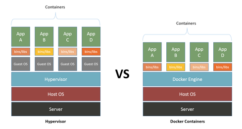

# Containerized Workshop
Welcome to the workshop about containerized technologies. In this workshop you will learn about visualization tools such [docker](https://docs.docker.com/) and [singularity](http://singularity.lbl.gov/).

Aim of this workshop is to teach you the best practices on how to use containerized technologies. After finishing this tutorial you will know how to package, distribute and share your software using docker and singularity.

## Requirements
Before you start workshop you have to fulfilled below requirements.

- [git](https://git-scm.com/downloads) - installed
- [docker](https://docs.docker.com/) - installed
- [dockerhub](https://hub.docker.com/) account
- [docker-compose](https://docs.docker.com/compose/install/#alternative-install-options) - installed
- [pytohn](https://www.python.org/downloads/) -installed
- [pip](https://pypi.python.org/pypi/pip) -installed
- [singularity](http://singularity.lbl.gov/) -installed
- sudo/root access - your machine

## Assumption
Workshop base on the assumption that all points in requirements are fulfilled.

# Virtualization
## What Is a Containerized Technology?
I think that we all know what word virtual means. We can agree that to be virtual is to replicate a physical reality into a digital representation that you can interact with e.g. Turing's chatbot, or virtual reality applications with Oculus Rift.

Let's talk about virtuality in context of containerized technologies. In the simplest way a containerized technologies are a software tools, that allows us to abstract physical resources like operating system/kernel into virtual one. Advantage of this abstraction allows us to package, interact and distribute not only a software, but as well environment that software depends on.

Consequences of this practice is something that software industry has been struggling a lot in the past decades -in the context of virtualization. Namely, reproducibility, portability, isolation and effective use of hardware. If I was about to close concept of containerized technology in one world then it would be a "virtual-box".

## Game Changer
If it's about visualization then we are living in Renaissance age. Containerized technologies has been there for a while. The best known technology developed so far was [VirtualBox](https://www.virtualbox.org/). However, its drawbacks such, image size, reproducibility, configuration and overhead, lead to development of new solutions and this is where Docker comes to play.

Docker is another virtualization software that allows you to package your software. To understand better what's so special about Docker lets compare it to VirtualMachine.

<a href="#">
  <p align="center">
    
  </p>
</a>

As you can see docker uses `docker engine` instead of `hypervision`. This change eliminates need of having **Guest OS**, and allows Docker to use hardware resources more efficient than VirtualMachine -reducing overhead. Just to let you know that it's achieved by [Namespaces](https://en.wikipedia.org/wiki/Linux_namespaces) but I will not go deep into it.

## Context is King
I would like stress that Docker is not a flawless tool that you should use for all your problems. Everything, depends on context. Base on the nature of the problem that you are dealing with docker might be the least favorable solution that you should work with. Some times it might be VirtualBox, other time Singularity or even another visualization technology that I am not aware of.

# Installation
Let's start with cloning this repository to your computer. Because this repository is a complete solution we will have to delete some files -don't worry we will recreate them as we proceed with the tutorial.

Please execute bellow instructions.
```bash
# Go to home directory
user@machine:~$ cd ~

# Clone project's repository
user@machine:~$ git clone https://github.com/ldynia/containerized-workshop

# Go to project's dir
user@machine:~$ cd containerized-workshop

# Remove these files
user@machine:~/containerized-workshop$ rm -rf .gitignore readme.md docker-compose.yml Dockerfile Singularity img/ app/scripts/
```

# Vocabulary
* **Image**  -is an **executable file(s) (tar file or sparse file) that contains a bunch of tools (software), environment variables, configuration files, source code installed on top/along with operating system**. I think of an image as it was a blueprint of a house -with one blueprint you can build infinite number of houses.
* **Container** -is an image that runs a process, other words **runtime instance of an image**. I think of a container as if it was a real house -a place where you can get in and start furnishing it.

## Program - Part I
Let me introduce you to our program that we'll call `fsa-analyzer`. This simple program works like this. It takes input a `*.fsa` file, and returns count of nucleotides. **Note:** The program returns output after 5 seconds -this is an intended behavior.

To see how our program works please execute bellow instructions.

```bash
# Go to app directory
user@machine:~/containerized-workshop$ cd app

# Run program
user@machine:~/containerized-workshop/app$ python main.py data/dna.fsa
{"nucleotides_count": {"A": 333, "C": 454, "T": 303, "G": 469}}

# Or run program and pritify its output
user@machine:~/containerized-workshop/app$ python main.py data/dna.fsa | python -m json.tool
{
    "nucleotides": {
        "A": 333,
        "C": 454,
        "G": 469,
        "T": 303
    }
}

# Go back to containerized-workshop directory
user@machine:~/containerized-workshop/app$ cd ..
```

# Docker
## Docker Image - Part I
Enough definitions! Let's download first docker image. An image that we will download will contain Alpine Linux - Linux distribution.

```bash
# Pull alpine linux image from dockerhub
user@machine:~/containerized-workshop$ docker pull alpine:3.6

# List all available images
user@machine:~/containerized-workshop$ docker images
REPOSITORY          TAG                 IMAGE ID            CREATED             SIZE
alpine              3.6                 a41a7446062d        2 weeks ago         3.97MB
```

## Docker Container - Part I
A container is an awesome thing, it has capabilities to grow. You can literally pack into it your source code, config files, data files, other software, etc... and it will persist this data. On the other hand when an image is created (build) it will persist only data that where used in the process of building the image. **Remember an image is the blueprint a container is the real thing!**

Saying that let's get going, and let's create our first container.

```bash
# Let's run downloaded image, and let's install python there.
# After installation we will create hello.py script to verify that python works.
user@machine:~/containerized-workshop$ docker run -it alpine:3.6
/ # apk update
/ # apk add python
/ # echo -e "#!/usr/bin/python \n\nprint('docker rocks!')" > hello.py
/ # ls -l
/ # python hello.py
/ # ln -s /hello.py /usr/local/bin/yo!
/ # chmod +x /usr/local/bin/yo!
/ # yo!
docker rocks!
```


Remember that `docker run` command is always executed against an image and output of it creates a **container**. At any time you can check how many containers docker is running with `docker ps` command. You will see that a container has an id, a name (*angry_swanson*) and image associated with it, as well as other information.

```bash
# Open new terminal and list running containers.
user@machine:~$ docker ps
CONTAINER ID        IMAGE               COMMAND             CREATED              STATUS              PORTS               NAMES
878469647aa4        alpine:3.6          "/bin/sh"           About a minute ago   Up About a minute                       angry_swanson
```

To exit our container press `Ctrl+D`

```bash
docker rocks! (Ctrl + D)
user@machine:~/containerized-workshop$
```

With `Ctrl + D` we exited (and stopped) *angry_swanson* container. So let's check if our container is running. To do that we will execute `docker ps` again.

```bash
# List all running containers
user@machine:~$ docker ps
CONTAINER ID        IMAGE               COMMAND             CREATED              STATUS              PORTS               NAMES
```

No surprises there. The question is what happened to the container. Was it deleted with the moment when we stopped it? Was it abducted by aliens? and finally was 9.11 an inside job?

Being serious, to see stopped containers execute bellow command.

```bash
# List all stopped containers
user@machine:~/containerized-workshop$ docker ps -a
CONTAINER ID        IMAGE               COMMAND             CREATED             STATUS                      PORTS               NAMES
878469647aa4        alpine:3.6          "/bin/sh"           About an hour ago   Exited (0) 40 minutes ago                       angry_swanson
```

As we can see *angry_swanson* is still there and it was not deleted. The question is can we bring back to live and run our `yo!` program?
``
Yes we can, to start a container execute bellow command.

```bash
# Start container
user@machine:~/containerized-workshop$ docker start angry_swanson

# List all running containers
user@machine:~$ docker ps
CONTAINER ID        IMAGE               COMMAND             CREATED             STATUS              PORTS               NAMES
878469647aa4        alpine:3.6          "/bin/sh"           About an hour ago   Up 4 minutes                            angry_swanson
```

Container are awesome because you can interact with them. To interact with a container you use `exec` command. Let's exec our `yo!` program again.

```bash
# Run yo! program against docker container
user@machine:~/containerized-workshop$ docker exec angry_swanson yo!
docker rocks!
```

Remember that exec works only with running container. Let's see what will happened when we will stop a container.

```bash
# Stop container
user@machine:~/containerized-workshop$ docker stop angry_swanson

# Run exec against stopped container
user@machine:~/containerized-workshop$ docker exec angry_swanson yo!
Error response from daemon: Container 878469647aa4611b36de1f97a8e9d1273fbeb228ac355777e4e1b02e118fa272 is not running
```

The best part about containers is that we can hook into it. Let me demonstrate.

```bash
# Start angry_swanson again
user@machine:~/containerized-workshop$ docker start angry_swanson

# Hook in into container
user@machine:~/containerized-workshop$ docker exec -it angry_swanson sh
/ ls -l
total 56
drwxr-xr-x    2 root     root          4096 May 25 15:18 bin
drwxr-xr-x    5 root     root           360 Jun 17 18:52 dev
drwxr-xr-x   16 root     root          4096 Jun 17 17:52 etc
-rwxr-xr-x    1 root     root            43 Jun 17 17:52 hello.py
drwxr-xr-x    2 root     root          4096 May 25 15:18 home
drwxr-xr-x    6 root     root          4096 Jun 17 17:52 lib
drwxr-xr-x    5 root     root          4096 May 25 15:18 media
drwxr-xr-x    2 root     root          4096 May 25 15:18 mnt
dr-xr-xr-x  289 root     root             0 Jun 17 18:52 proc
drwx------    2 root     root          4096 Jun 17 17:52 root
drwxr-xr-x    2 root     root          4096 May 25 15:18 run
drwxr-xr-x    2 root     root          4096 May 25 15:18 sbin
drwxr-xr-x    2 root     root          4096 May 25 15:18 srv
dr-xr-xr-x   13 root     root             0 Jun 17 18:52 sys
drwxrwxrwt    2 root     root          4096 May 25 15:18 tmp
drwxr-xr-x   12 root     root          4096 Jun 17 17:53 usr
drwxr-xr-x   13 root     root          4096 Jun 17 17:52 var

/ top
Mem: 4979744K used, 3105372K free, 482628K shrd, 852336K buff, 1532500K cached
CPU:   0% usr   0% sys   0% nic  87% idle  12% io   0% irq   0% sirq
Load average: 0.22 0.50 0.68 2/853 53
  PID  PPID USER     STAT   VSZ %VSZ CPU %CPU COMMAND
    1     0 root     S     1544   0%   2   0% /bin/sh
   31     0 root     S     1544   0%   0   0% sh
   44     0 root     S     1544   0%   2   0% sh
   53    44 root     R     1536   0%   7   0% top
   25     0 root     S     1532   0%   5   0% sh
```

Notice that only few processes are running inside our container (Alpine Linux). It's because container's processes are isolated from the system processes.

## Docker Image - Part II - Dockerfile
Going back to our `fsa-analyzer`. Suddenly, we discovered that our program is the *"real deal"* scientists love it, a monk opened a champaign and, a vegan ate his first steak. ([Leeroy Jenkins!!!!](https://www.youtube.com/watch?v=hooKVstzbz0)).

We decided to create our own image and we will pack there our program. To make our program running we need 3 things. Source code (checked), operating system (checked -Alpine Linux), Python (not checked).

To build an image you have to create a `Dockerfile` (the blueprint file). This file will contain set of instructions executed line by line from top to bottom.

Crate a `Dockerfile`

```bash
user@machine:~/containerized-workshop$ touch Dockerfile
```

Enter bellow content into `Dockerfile`.

```
# ~/containerized-workshop/Dockerfile
FROM alpine:3.6

MAINTAINER Lukasz Dynowski ludd@bioinformatics.dtu.dk

# Copy app dir form host into image
COPY ./app /app
WORKDIR /app

# OS Update & Upgrade
RUN apk update && apk upgrade

# Install packages
RUN apk add \
  python \
  py-pip

# Install application wide packages
RUN pip install -r requirements.txt

# Execute script as a global program
RUN ln -s /app/main.py /usr/local/bin/fsa-analyzer
RUN chmod +x /usr/local/bin/fsa-analyzer
```

To build and image from a `Dockerfile` execute bellow command. **Replace _ldynia_ with your dockerhub username !!!**

```bash
# Build docker image with Dockerfile
user@machine:~/containerized-workshop$ docker build -t ldynia/conteneraized-workshop:1.0 .
Successfully built d80e90d300bc
Successfully tagged ldynia/conteneraized-workshop:1.0

# Display available images
user@machine:~/containerized-workshop$ docker images
REPOSITORY                      TAG                 IMAGE ID            CREATED             SIZE
alpine                          3.6                 a41a7446062d        2 weeks ago         3.97MB
ldynia/conteneraized-workshop   1.0                 d80e90d300bc        6 minutes ago       59.7MB
```

Let's crate a container from our newly created image and see if our program works. At the same time when program is running open a new terminal and execute `docker ps` command. Execute docker `docker ps` once more after the program is ended.

```bash
# Run our program
user@machine:~/containerized-workshop$ docker run ldynia/conteneraized-workshop:1.0 fsa-analyzer /app/data/dna.fsa | python -m json.tool
{
    "nucleotides": {
        "A": 333,
        "C": 454,
        "G": 469,
        "T": 303
    }
}
```

```bash
# While our program is running execute `docker ps`
user@machine:~/containerized-workshop$ docker ps
CONTAINER ID        IMAGE                               COMMAND                  CREATED             STATUS              PORTS               NAMES
db8b56d90a48        ldynia/conteneraized-workshop:1.0   "fsa-analyzer /app..."   2 seconds ago       Up 1 second                             sharp_brown
878469647aa4        alpine:3.6                          "/bin/sh"                2 hours ago         Up 24 seconds                           angry_swanson

# After program prodiced output run `docker ps` again
CONTAINER ID        IMAGE                               COMMAND                  CREATED             STATUS              PORTS               NAMES
878469647aa4        alpine:3.6                          "/bin/sh"                2 hours ago         Up 24 seconds                           angry_swanson
```

As you can see our *sharp_brown* container was visible for 5 seconds and disappeared right after our program ended. There is a way to keep container up (running) and I will show you how to do it in **Program - Part II**

## Docker Hub
Our program is a "break through" in scientific world and we decided to share it. To share your image with the whole world, you have to push it to [dockerhub](https://hub.docker.com) (you need to have an account there).

```bash
# Login into your account
user@machine:~/containerized-workshop$ docker login
Username (ldynia):

# Push tagged image to dockerhub
user@machine:~/containerized-workshop$ docker push ldynia/conteneraized-workshop:1.0
6c2769b873a4: Pushed
3854ae9c567b: Pushed
83b2e5750cd8: Pushed
2d791707ea0c: Pushed
5657379b46c0: Pushed
1c6ebc6ec0de: Pushed
4af3319f243b: Pushed
9b91d471feb9: Pushed
7f188a09b991: Pushed
3fb66f713c9f: Mounted from library/alpine
1.0: digest: sha256:f867cdf4ab69cecea051230a0ecf8d3880148a5f496c9bd5977d27e5ed8ed534 size: 2416
```

Now everyone in the world can download your image and run it as a container.

```bash
# Remove image from your machine
user@machine:~/containerized-workshop$ docker rmi -f ldynia/conteneraized-workshop:1.0

# To pull image from dockerhub execute bellow command
user@machine:~/containerized-workshop$ docker pull ldynia/conteneraized-workshop:1.0

# Let's remove unused containers
user@machine:~/containerized-workshop$ docker container prune
```

## Program - Part II
Time passes, our image is a great success you got 2M+ downloads per day and we decided to improve `fsa-analyzer`.

Let's introduce bellow changes to `main.py` file.

```bash
## ~/containerized-workshop/app/main.py
#time.sleep(5)

statistics = {
    'codons_count': stats.count_codons(),
    'nucleotides_count': stats.count_nucleotides(),
}
```

As well we will create an executable bash script that will enforce container to stay up and running. Create this file `~/containerized-workshop/app/scripts/startup.sh`.

```bash
#!/bin/bash

# sleep infinity
echo "Starting infinity loop!"
while sleep 3600; do :; done
```

Additionally, we have to add a command at the end of our `Dockerfile`. This command will execute startup script every time an image is run.

```bash
# Startup script
CMD ["sh", "/app/scripts/startup.sh"]
```

Let's build new image.

```
# Build new image
user@machine:~/containerized-workshop$ docker build -t ldynia/conteneraized-workshop:2.0 .
Successfully built c6fbaab9ba28
Successfully tagged ldynia/conteneraized-workshop:2.0
```

Let's test our new program.

```bash
# Run program
user@machine:~/containerized-workshop$ docker run ldynia/conteneraized-workshop:2.0 fsa-analyzer /app/data/dna.fsa | python -m json.tool
{
  "codons_count" : {
    "AAA": 8
    ...
    "TTT": 8
  },
  "nucleotides_count": {
      "A": 333,
      "C": 454,
      "G": 469,
      "T": 303
  }
}
```

Since our updated program works as expected, we will share it with the whole world again.

```bash
# Tag the image and push it to dockerhub
user@machine:~/containerized-workshop$ docker push ldynia/conteneraized-workshop:2.0
```

Do you remember what I said about keeping a container up (running)? To keep container up we created `startup.sh` script that will be executed every time when our image is run. Let's see what I mean by that.

Let's open two terminals. In one terminal we will create a container with `docker run` command. In other terminal we will display running containers with `docker ps`.

**conteneraized-workshop:1.0**

```bash
# Run image detach -in first terminal
user@machine:~/containerized-workshop$ docker run -d --name container1.0 ldynia/conteneraized-workshop:1.0

# Display running containers in second terminal
user@machine:~/containerized-workshop$ docker ps
CONTAINER ID        IMAGE                               COMMAND             CREATED                  STATUS                  PORTS               NAMES
a28dd7cecf80        ldynia/conteneraized-workshop:1.0   "/bin/sh"           Less than a second ago   Up Less than a second                      container1.0
```

**conteneraized-workshop:2.0**

```bash
# Run image detach -in first terminal
user@machine:~/containerized-workshop$ docker run -d --name container2.0 ldynia/conteneraized-workshop:2.0

# Display running containers in second terminal
user@machine:~/containerized-workshop$ docker ps
CONTAINER ID        IMAGE                               COMMAND                  CREATED             STATUS              PORTS               NAMES
f3ddc0056c60        ldynia/conteneraized-workshop:2.0   "bash /app/scripts..."   3 seconds ago       Up 2 seconds                            container2.0
```

You can see that `container2.0` is up and running where, container `container1.0` was exited straight after execution.

## Docker Container - Part II
There are some advantages of keeping containers up and running. One of it's that containers persist data -*removing container equals to deleting data*. Another is, that you can interact with container as if you were interacting with an image.

Remember that a container is running instance of the image. As my collage said in Object Oriented way *"if an image is a class then a container is an object"*

We used `docekr run` to interact with an image. To interact with a container we use `docker exec`

```bash
# Run fsa-analyzer against running container
user@machine:~/containerized-workshop$ docker exec container2.0 fsa-analyzer /app/data/dna.fsa
```

## Docker Volumes
Even thought our program kicks asses and *"nerds"* go crazy about it -since it was mentioned in the [science](http://www.sciencemag.org/). There is a serious draw back. Namely, it can analyze only one file (the file that we copied when we builded our image). This is where volumes come with help. **Volume** is a **bridge that connects your machine files system with a container**.

Enough talking let's create a volume. To demonstrate that volumes works we will create new directory (`data-x`) and fsa file (`rsa.fsa`).

```bash
# Create dummy data
user@machine:~/containerized-workshop$ cd app/
user@machine:~/containerized-workshop/app$ cp -r data/ data-x/
user@machine:~/containerized-workshop/app$ cd data-x
user@machine:~/containerized-workshop/app/data-x$ mv dna.fsa rna.fsa
user@machine:~/containerized-workshop/app/data-x$ cd ../..

# Add volume to image/container
user@machine:~/containerized-workshop$ docker run -d --name playground -v $(pwd)/app/data-x:/data-x ldynia/conteneraized-workshop:2.0
user@machine:~/containerized-workshop$ docker ps
CONTAINER ID        IMAGE                               COMMAND                  CREATED              STATUS              PORTS               NAMES
3da8ba3b7fb4        ldynia/conteneraized-workshop:2.0   "bash /app/scripts..."   About a minute ago   Up About a minute                       playground

# Check if our volume works
user@machine:~/containerized-workshop$ docker exec playground fsa-analyzer /data-x/rna.fsa | python -m json.tool
{
    "codons": {
        "AAA": 8,
        ....
        "TTT": 8
    },
    "nucleotides": {
        "A": 333,
        "C": 454,
        "G": 469,
        "T": 303
    }
}
```

## Docker compose
I have to admit that, writing long executable commands full of flags in terminal is the last thing that I want to do! If you share my pain then there is a solution for it. What if I told you that you could do all this terminal *mambo-jumob* with a one file and one command excited?, Here is where `docker-compose` comes to play.

Let's create a docker-compose file `docker-compose.yml` and copy-paste bellow content.

```
# ~/containerized-workshop/docker-compose.yml
version: '3'

services:

  application:
    image: ldynia/conteneraized-workshop:2.0
    build: .
    restart: always
    container_name: demo
    volumes:
      - ./app/data-x:/data-x
    environment:
      MAGIC: abbracadabbra
    command: sh scripts/startup.sh
```

Once our docker-compose file is create let's run it.

```bash
# Run docker-compose in detach mode
user@machine:~/containerized-workshop$ docker-compose up -d
Creating demo ...
Creating demo ... done

# Execute fsa-analyzer to check if everrything is working
user@machine:~/containerized-workshop$ docker exec demo fsa-analyzer /data-x/rna.fsa | python -m json.tool
{
    "nucleotides_count": {
        "A": 333,
        "C": 454,
        "G": 469,
        "T": 303
    }
}

# Stop container with docker-compose
user@machine:~/containerized-workshop$ docker-compose stop
Stopping demo ... done
```

# Singularity
Even thought docker rocks! There are some aspects of it (due to its implementation) that will not make docker the best solution for your needs.

[Singularity](http://singularity.lbl.gov/), is another containerized solution that addresses similar problems as docker but, with different approach. The best part of it's that it utilizes docker images :) You will be astonished how simple it's to containerize your application (software).

In this section we will package our `fsa-analyzer` into a singularity image.

## Container
Let's create our first singularity container.

```bash
# Create an image
user@machine:~/containerized-workshop$ sudo singularity build --sandbox alpine/ docker://alpine:3.6
WARNING: Building sandbox as non-root may result in wrong file permissions
Docker image path: index.docker.io/library/alpine:3.6
Cache folder set to /home/ludd/.singularity/docker
Importing: base Singularity environment
Importing: /home/ludd/.singularity/docker/sha256:b56ae66c29370df48e7377c8f9baa744a3958058a766793f821dadcb144a4647.tar.gz
Importing: /home/ludd/.singularity/metadata/sha256:dee84a4c12468c1ceaff6effeab567b3cd6e2dcc403a33b357e04abf9f3a1d7f.tar.gz
WARNING: Building container as an unprivileged user. If you run this container as root
WARNING: it may be missing some functionality.
Singularity container built: alpine/
Cleaning up...

# content of the directory/container is alpine Linux distribution files.
user@machine:~/containerized-workshop$ tree -L 1 alpine/
alpine/
├── bin
├── dev
├── environment -> .singularity.d/env/90-environment.sh
├── etc
├── home
├── lib
├── media
├── mnt
├── proc
├── root
├── run
├── sbin
├── singularity -> .singularity.d/runscript
├── srv
├── sys
├── tmp
├── usr
└── var
```

Once container is create lets start interacting with it.

```bash
# Shell into image
user@machine:~/containerized-workshop$ singularity shell alpine/
Singularity: Invoking an interactive shell within container...

# Check usernaem
Singularity> whoami
username

# Update repository list
Singularity> apk update
ERROR: Unable to lock database: Permission denied
ERROR: Failed to open apk database: Permission denied

# install vim package
Singularity> apk add vim
ERROR: Unable to lock database: Permission denied
ERROR: Failed to open apk database: Permission denied

Singularity> exit
```

As we can see above we cannot install packages because we don't have sudo access. Let's change this.

```bash
# Login as a root
user@machine:~/containerized-workshop$ sudo singularity shell alpine/
Singularity: Invoking an interactive shell within container...

Singularity> whoami
root

# Update repositories
Singularity> apk update
fetch http://dl-cdn.alpinelinux.org/alpine/v3.6/main/x86_64/APKINDEX.tar.gz
fetch http://dl-cdn.alpinelinux.org/alpine/v3.6/community/x86_64/APKINDEX.tar.gz
v3.6.2-196-gac6c8a8f2e [http://dl-cdn.alpinelinux.org/alpine/v3.6/main]
v3.6.2-197-gb2cee117dd [http://dl-cdn.alpinelinux.org/alpine/v3.6/community]
OK: 8438 distinct packages available

# Install packages
Singularity> apk add vim
(1/5) Installing lua5.2-libs (5.2.4-r2)
(2/5) Installing ncurses-terminfo-base (6.0_p20170930-r0)
(3/5) Installing ncurses-terminfo (6.0_p20170930-r0)
(4/5) Installing ncurses-libs (6.0_p20170930-r0)
(5/5) Installing vim (8.0.0595-r0)
Executing busybox-1.26.2-r7.trigger
OK: 37 MiB in 16 packages
Singularity> exit
```

## Executing commands
Running commands in Singularity is straight forward. Just run command using `exec` keyword agains Singularity container.

```bash
user@machine:~/containerized-workshop$ singularity exec alpine/ ls -l /
total 4
drwxr-xr-x    2 root     root          1069 Oct 26 00:05 bin
drwxr-xr-x   21 root     root          4720 Nov  3 10:57 dev
lrwxrwxrwx    1 root     root            36 Nov  3 11:06 environment -> .singularity.d/env/90-environment.sh
drwxr-xr-x   14 root     root           557 Oct 26 00:05 etc
drwxr-xr-x    1 root     root            60 Nov  3 11:28 home
drwxr-xr-x    5 root     root           243 Oct 26 00:05 lib
drwxr-xr-x    5 root     root            53 Oct 26 00:05 media
drwxr-xr-x    2 root     root             3 Oct 26 00:05 mnt
dr-xr-xr-x  356 root     root             0 Nov  3 10:56 proc
drwx------    2 root     root             3 Oct 26 00:05 root
drwxr-xr-x    2 root     root             3 Oct 26 00:05 run
drwxr-xr-x    2 root     root           911 Oct 26 00:05 sbin
lrwxrwxrwx    1 root     root            24 Nov  3 11:06 singularity -> .singularity.d/runscript
drwxr-xr-x    2 root     root             3 Oct 26 00:05 srv
dr-xr-xr-x   13 root     root             0 Nov  3 10:56 sys
drwxrwxrwt   13 root     root          4096 Nov  3 11:24 tmp
drwxr-xr-x    7 root     root            87 Oct 26 00:05 usr
drwxr-xr-x   12 root     root           134 Oct 26 00:05 var
```

## Writing into container
As you can see Singularity is very strict about who can interact with the image and what can be written there. Previously we run `apk update` and `apk add vim` against our sndboxed container the question is was our change persisted?

Let's check it.

```bash
user@machine:~/containerized-workshop$ sudo singularity exec alpine/ vim
/.singularity.d/actions/exec: exec: line 9: vim: not found
```

As you can see our changes were not persisted. To write into a container just add `--writable` flag.

```bash
# Login as a sudo in writable mode
user@machine:~/containerized-workshop$ sudo singularity shell --writable alpine/
Singularity: Invoking an interactive shell within container...

Singularity> apk update
Singularity> apk add vim
Singularity> exit

user@machine:~/containerized-workshop$ singularity exec alpine/ vim
```

## Building images
Once we package our software into Singularity container we can start building an image out of containers.

To build Singularity image execute this command.

```bash
# Build image from container
user@machine:~$ sudo singularity build alpine.img alpine/
Building image from sandbox: alpine/
Building Singularity image...
Singularity container built: alpine.img
Cleaning up...

# check content of directory
user@machine:~/containerized-workshop$ ls -l
total 11444
drwxr-xr-x 19 root root     4096 Nov  6 13:42 alpine
-rwxr-xr-x  1 root root 11657247 Nov  6 13:45 alpine.img
drwxrwxr-x  5 ludd ludd     4096 Nov  6 13:40 app
-rw-rw-r--  1 ludd ludd      265 Nov  6 13:40 docker-compose.yml
-rw-rw-r--  1 ludd ludd      493 Nov  6 13:40 Dockerfile
drwxrwxr-x  2 ludd ludd     4096 Nov  6 13:40 img
-rw-rw-r--  1 ludd ludd    32639 Nov  6 13:40 readme.md
-rw-rw-r--  1 ludd ludd      630 Nov  6 13:40 Singularity

# Check if image
user@machine:~/containerized-workshop$ singularity exec alpine.img vim
```
## Binding data
What if our application depends on a data that is simply to big to be packed into an image. With docker we had chance of tackling this problem with volumes. Singularity uses `bind` flag to mount directory from host into a container.

```bash
user@machine:~/containerized-workshop$ singularity exec --bind app/data/:/data-x alpine.img ls -l /
total 8
drwxr-xr-x    2 root     root          1069 Oct 26 00:05 bin
drwxrwxr-x    2 ludd     ludd          4096 Nov  6 14:43 data-x
...
drwxr-xr-x   12 root     root           134 Oct 26 00:05 var
```


## Recipe file
We know that it's a bit of a hassle to do everything from terminal. Fortunately, we can automatize our work and create `recipes file` (Singularity file), which is equivalent to a Dockerfile.

Create Singularity file (`~/containerized-workshop/Singularity`) and copy-paste bellow content into it.

```bash
# Singularity bootstrap file
Bootstrap: docker
From: alpine:3.6

%labels
AUTHOR ludd@bioinformatics.dtu.dk
Version 1.0

# 'setup' section is executed on the host system outside of the container after the base OS has been installed!
%setup
mkdir $SINGULARITY_ROOTFS/app

# Copy files from your host system into the container!
%files
app/*   /app

# 'environment' variables are sourced at runtime and not at build time!
%environment
MAGIC=abbracadabbra
export MAGIC

# 'post' section is where you can install, and configure your container.
%post
# OS Update & Upgrade
apk update && apk upgrade

# Install packages
apk add \
  git \
  python \
  py-pip

# Execute script as a global program
ln -s /app/main.py /usr/local/bin/fsa-analyzer
chmod +x /usr/local/bin/fsa-analyzer

# Executed on 'singularity run img'
%runscript
echo "The runscript is the containers default runtime command!"
echo $MAGIC
```

Once file is created then we will build image from it.

```bash
# Recreate alpine image
user@machine:~/containerized-workshop$ sudo singularity build analyzer.img Singularity

# Check if it works!
user@machine:~/containerized-workshop$ singularity exec analyzer.img fsa-analyzer /app/data/dna.fsa
{"nucleotides": {"A": 333, "C": 454, "T": 303, "G": 469}}
```

## Distributing Singularity Image
[SingulartyHub](https://www.singularity-hub.org/collections/new) is the place where you would like to push your images. You can create an account at SingulartyHub by login with your github. Once you do this you will create a Singularity collection by binding it with your github repository. When SingularityHub will finish building your image whole world will have access to it.  

In order to pull SingulartyHub image into your computer you have two possibilities execute below commands to see how it works.

```bash
user@machine:~/containerized-workshop$ singularity pull docker://username/repository-name
user@machine:~/containerized-workshop$ singularity pull shub://username/repository-name
user@machine:~/containerized-workshop$ sudo singularity build image-name.img shub://usernmae/repository-name

# example
user@machine:~/containerized-workshop$ singularity pull docker://alpine:3.6
user@machine:~/containerized-workshop$ singularity pull shub://ldynia/containerized-workshop
user@machine:~/containerized-workshop$ sudo singularity build fsa-analyzer.img shub://ldynia/containerized-workshop
```

Alternatively, you can share your image by sending it via email, copy it on usb stick or upload to cloud -you name it!, just deliver it to person that you want to share it with.
